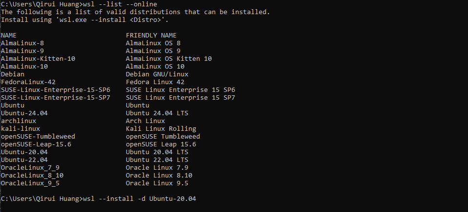
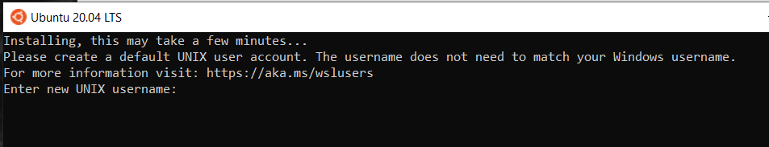
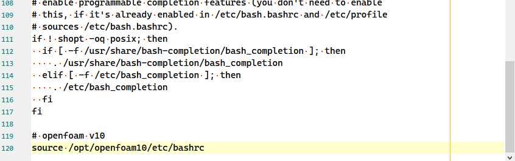
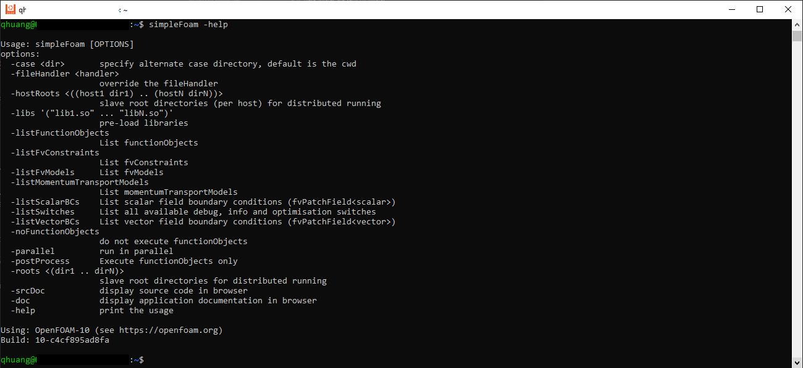
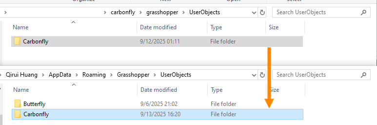
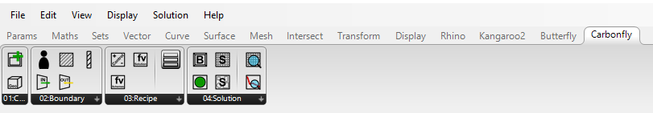
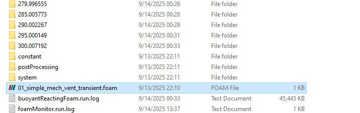
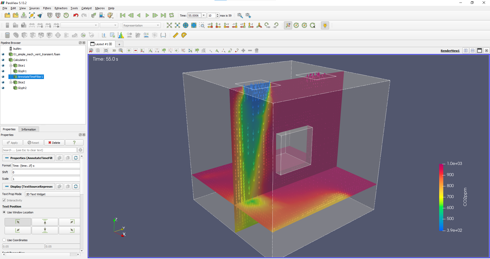

# Carbonfly

## How to install?

- [Step 1: Install WSL](#step-1-install-wsl)
- [Step 2: Install OpenFOAM v10](#step-2-install-openfoam-v10)
- [Step 3: Install Carbonfly](#step-3-install-carbonfly)
  - [Manual installation](#manual-installation)
  - [Installer](#installer)
- [Step 4: Install ParaView (optional)](#step-4-install-paraview-optional)

### Step 1: Install WSL

Install WSL 2 with Ubuntu-20.04 (should also work with Ubuntu-22.04, not tested), see [WSL Documentation - How to install Linux on Windows with WSL](https://learn.microsoft.com/en-us/windows/wsl/install):

1. `wsl --install`

2. `wsl --install -d Ubuntu-20.04`

3. Open `Ubuntu 20.04 LTS`, you will see the following console. Please set up your WSL, see [Set up a WSL development environment](https://learn.microsoft.com/en-us/windows/wsl/setup/environment#set-up-your-linux-username-and-password)

4. Once you have finished setting up, you should see the following welcome message:

[Back to top ↥](#carbonfly)

### Step 2: Install OpenFOAM v10

Install OpenFOAM v10 in WSL, see [Download v10 | Ubuntu](https://openfoam.org/download/10-ubuntu/):

1. `sudo sh -c "wget -O - https://dl.openfoam.org/gpg.key > /etc/apt/trusted.gpg.d/openfoam.asc"`
2. `sudo add-apt-repository http://dl.openfoam.org/ubuntu`
3. `sudo apt-get update`
4. `sudo apt-get -y install openfoam10`

As described in OpenFOAM documentation, complete the following:

5. Find the `.bashrc` file in the user's home directory, e.g. using Windows File Explorer: `Linux/Ubuntu-20.04/home/user/.bashrc` and open the file using any text editor app e.g. [Notepad 3](https://github.com/rizonesoft/Notepad3)

6. At the bottom of that file, add `source /opt/openfoam10/etc/bashrc` and save the file.

7. Restart WSL and test with `simpleFoam -help` in a new WSL window:

[Back to top ↥](#carbonfly)

### Step 3: Install Carbonfly

#### Manual installation

1. Download source code of latest release from [Releases](https://github.com/RWTH-E3D/carbonfly/releases)
2. Unzip the source code file
3. Copy the `carbonfly` folder to the Rhino 8 script path: `%AppData%\McNeel\Rhinoceros\8.0\scripts`

4. Copy the `Carbonfly` folder (under `grasshopper/UserObjects`) to the `%AppData%\Grasshopper\UserObjects`

5. Start Rhino and Grasshopper. You should now see Carbonfly in the tabs:

6. To help you get started quickly, we've prepared numerous examples. See [Examples](./examples).

#### Installer

Coming soon...

[Back to top ↥](#carbonfly)

### Step 4: Install ParaView (optional)

Although [ParaView](https://www.paraview.org/) (for post-processing) should be automatically installed in the WSL environment during OpenFOAM v10 installation, it is still recommended to install an additional [ParaView](https://www.paraview.org/) instance in the Windows environment. This allows for more convenient viewing of results and post-processing after simulations.

After simulation, simply double-click the automatically generated `.foam` file to open ParaView and view simulation results for post-processing:

[Back to top ↥](#carbonfly)
