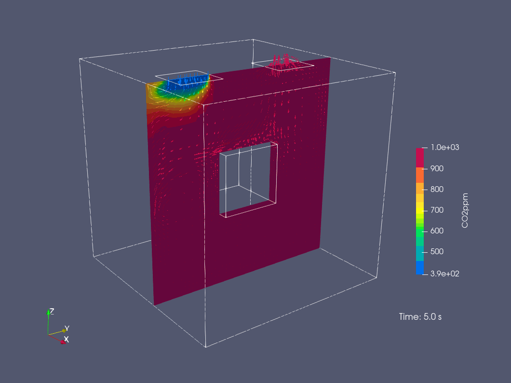

# Carbonfly


[](https://github.com/RWTH-E3D/carbonfly/releases)
&nbsp;
[](https://www.rhino3d.com/en/)&nbsp;
[](https://learn.microsoft.com/en-us/windows/wsl/install)&nbsp;
[](https://openfoam.org/version/10/)&nbsp;
[](https://github.com/RWTH-E3D/carbonfly/blob/master/LICENSE)&nbsp;
[](https://doi.org/10.5281/zenodo.17117827)

A lightweight, easy-to-use Python library and toolbox for indoor CO2 CFD simulation in Grasshopper, based on OpenFOAM and the Windows Subsystem for Linux (WSL).


## Quick Navigation

- [Key Features](#key-features)
- [Roadmap](#roadmap)
- [How to install?](#how-to-install)
- [Documentation](#documentation)
- [Instructions for Developers](#instructions-for-developers)
- [License](#license)
- [How to cite](#how-to-cite)

## Key Features

1. **Indoor ventilation CFD**: Run steady-state and transient simulations of CO2 transport, airflow, and buoyancy-driven temperature.
2. **Rhino-to-CFD in "one click"**: Use Rhino/Grasshopper geometry. Carbonfly handles meshing and other setups - no OpenFOAM text files to edit.
3. **Plug-and-play boundaries**: Presets for inlets, outlets, and walls etc., with sensible defaults you can tweak.
4. **Fast what-if studies**: Change flow rate, supply temperature, CO2 concentration, and diffuser placement and quickly rerun for comparison.
5. **Visualization-ready outputs**: Exports a standard OpenFOAM case for viewing CO2/velocity/temperature/pressure etc. in ParaView.

**See our [Examples](./examples):**




## Roadmap

<table style="width:100%">
  <tr>
    <th>Feature</th>
    <th>Status</th>
    <th>Implementation Details</th>
  </tr>
  <tr>
    <td>Transient and steady-state CFD simulation of indoor CO2 / temperature / velocity etc. for mechanical ventilation</td>
    <td>✅ Done (v0.1.0)</td>
    <td>Based on WSL 2 (Ubuntu-20.04) &amp; OpenFOAM v10. Solver <code>buoyantReactingFoam</code> which supports multi-species with enhanced buoyancy treatment. The reaction is disabled and only the mixing, mainly driven by buoyancy, is considered.</td>
  </tr>
  <tr>
    <td>Natural ventilation through open windows</td>
    <td>✅ Done (v0.3.0)</td>
    <td>
      See our <a href="./examples" alt="Examples" target="_blank">Examples</a>: 
      1) Transient: <code>Carbonfly Dynamic Window</code> based on <code>pressureInletOutletVelocity</code>;
      2) Steady-state: simplified split window (top/bottom);
      3) Bounding box (indoor + outdoor).
    </td>
  </tr>
  <tr>
    <td rowspan="2">Manikins with different Levels of Detail (LOD)</td>
    <td>✅ Done (v0.2.0)</td>
    <td>LOD0 Manikin is a simplified human model focused on CO2 dispersion. It is represented by straight lines and basic geometric volumes, without body part subdivision. Breathing is simplified to mouth breathing only, with no nasal passage. This abstraction is well suited for multi-occupant scenarios where reduced CFD mesh size and computational cost are essential.</td>
  </tr>
  <tr>
    <td>⏳ Planned</td>
    <td>LOD1/2/...</td>
  </tr>
  <tr>
    <td rowspan="2">Thermal comfort models</td>
    <td>✅ Done (v0.4.0)</td>
    <td>Gagge two-node model for standing, sitting, and sleeping positions (based on <a href="https://github.com/CenterForTheBuiltEnvironment/pythermalcomfort" alt="pythermalcomfort link">pythermalcomfort</a>)</td>
  </tr>
  <tr>
    <td>⏳ Planned</td>
    <td>Support more models</td>
  </tr>
  <tr>
    <td>Dynamic respiration</td>
    <td>✅ Done (v0.5.0)</td>
    <td>Time-varying mouth boundary for <code>U</code> via <code>codedFixedValue</code> (sine). Parameterized by breathing frequency and average breathing flow rate (L/min). Amplitude is computed from target ventilation and patch area.
    </td>
  </tr>
</table>

[Back to top ↥](#quick-navigation)

## How to install?

See [How to install](./HowToInstall.md)

## Documentation

See [Documentation](./documentation)

## Instructions for Developers

See [Instructions for Developers](./InstructionsForDevelopers.md)

## License

Carbonfly is a free, open-source plugin licensed under [LGPL-3.0](./LICENSE).

There are several ways you can contribute:

- 🐞 Report bugs or issues you encounter
- 💡 Suggest improvements or new features
- 🔧 Submit pull requests to improve the code or documentation
- 📢 Share the plugin with others who may find it useful

Copyright (C) 2025 Qirui Huang, [Institute for Energy Efficiency and Sustainable Building (E3D), RWTH Aachen University](https://www.e3d.rwth-aachen.de/go/id/iyld/?lidx=1)

[Back to top ↥](#quick-navigation)

## How to cite

If you want to cite **Carbonfly** in your academic work, there are two ways to do it:

- Each release is archived on [](https://doi.org/10.5281/zenodo.17117827). Please either cite the version you used as indexed at Zenodo (for reproducibility) or cite all versions.

  **Examples:**

  BibTeX:

  ```bibtex
  @software{Carbonfly_Huang,
    author    = {Qirui Huang},
    title     = {Carbonfly},
    subtitle  = {A lightweight, easy-to-use Python library and toolbox for indoor CO2 CFD simulation in Grasshopper},
    date      = {2025},
    publisher = {Zenodo},
    url       = {https://github.com/RWTH-E3D/carbonfly},
    note      = {GitHub repository},
    doi       = {10.5281/zenodo.17117827}
  }
  ```

  APA style:
  ```
  Huang, Q. (2025). Carbonfly: A lightweight, easy-to-use Python library and toolbox for indoor CO2 CFD simulation in Grasshopper [Computer software]. Zenodo. https://doi.org/10.5281/zenodo.17117827
  ```

- If you wish to cite **Carbonfly** for its design, methodology, etc. (rather than a specific release), please cite our paper:

  Coming soon...

[Back to top ↥](#quick-navigation)
