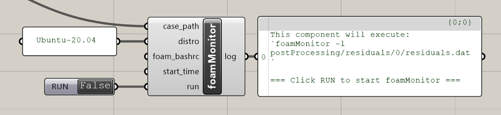

# Carbonfly Toolbox Documentation

<!-- TOC -->
* [Carbonfly Toolbox Documentation](#carbonfly-toolbox-documentation)
  * [Grasshopper toolbox](#grasshopper-toolbox)
    * [01:Create](#01create)
      * [CreateCFCase](#createcfcase)
      * [CreateCFGeometry](#createcfgeometry)
      * [Carbonfly Info](#carbonfly-info)
    * [02:Boundary](#02boundary)
      * [Body](#body)
      * [Dynamic Respiration](#dynamic-respiration)
      * [Dynamic Window](#dynamic-window)
      * [InletVelocity](#inletvelocity)
      * [internalFields](#internalfields)
      * [Outlet](#outlet)
      * [RecircReturn](#recircreturn)
      * [RecircSupply](#recircsupply)
      * [Wall](#wall)
    * [03:Recipe](#03recipe)
      * [controlDict](#controldict)
      * [fvSchemes](#fvschemes)
      * [fvSolution](#fvsolution)
      * [Residual Control List](#residual-control-list)
    * [04:Solution](#04solution)
      * [blockMesh](#blockmesh)
      * [runFoam](#runfoam)
      * [snappyHexMesh](#snappyhexmesh)
      * [surfaceFeatures](#surfacefeatures)
      * [checkMesh](#checkmesh)
      * [foamMonitor](#foammonitor)
    * [05:Util](#05util)
      * [Air Exchange Rate (Maas)](#air-exchange-rate-maas)
      * [BSA (Du Bois)](#bsa-du-bois)
      * [CO2 generation rate](#co2-generation-rate)
      * [Gagge two-node model](#gagge-two-node-model)
      * [Gagge two-node model (sleep)](#gagge-two-node-model-sleep)
      * [Surface Wind Pressure](#surface-wind-pressure)
      * [Manikin LOD 0](#manikin-lod-0)
      * [Met List](#met-list)
    * [06:Post-processing](#06post-processing)
      * [internalProbes](#internalprobes)
      * [postProcess](#postprocess)
      * [Read Results](#read-results)
      * [CO2-based IAQ](#co2-based-iaq)
      * [Carbonfly IAQ Standards](#carbonfly-iaq-standards)
<!-- TOC -->

## Grasshopper toolbox

### 01:Create

#### CreateCFCase


Create Carbonfly case


| Inputs                                                                                                     | Outputs                                  |
|------------------------------------------------------------------------------------------------------------|------------------------------------------|
| `case_dir` *(str)*: OpenFOAM case root folder                                                              | `log` *(str)*: Log                       |
| `case_name` *(str)*: Carbonfly case name                                                                   | `case_path` *(str)*: Carbonfly case path |
| `CF_geo` *(from [CreateCFGeometry](#createcfgeometry))*: List of Carbonfly Geometry objects                |                                          |
| `unit` *(str)*: "mm" (default), "cm", "m", unit setting in Rhino -> STL will be scaled to meters on export |                                          |
| `controlDict` *(from [controlDict](#controldict))*: Carbonfly controlDict                                  |                                          |
| `fvSchemes_path` *(from [fvSchemes](#fvschemes) or custom path (str))*: fvSchemes template path            |                                          |
| `fvSolution_path` *(from [fvSolution](#fvsolution) or custom path (str))*: fvSolution template path        |                                          |
| `residual` *(float)*: Residual control, e.g. 1e-5                                                          |                                          |
| `insidePoint` *(Point3d)*: A reference point inside the mesh/room                                          |                                          |
| `internalFields` *(from [internalFields](#internalfields))*: Carbonfly internalFields                      |                                          |
| `run` *(bool)*: When True, create Carbonfly case                                                           |                                          |

[Back to top ↥](#carbonfly-toolbox-documentation)

#### CreateCFGeometry


Create Carbonfly geometry


| Inputs                                                                                          | Outputs                      |
|-------------------------------------------------------------------------------------------------|------------------------------|
| `name` *(str)*: Region/solid name for STL & regions{}                                           | `log` *(str)*: Log           |
| `geometry` *(GeometryBase)*: Single surface/face/brep or a collection                           | `CF_geo`: Carbonfly Geometry |
| `boundary` *(from [02:Boundary](#02boundary))*: Carbonfly boundary                              |                              |
| `refine_levels` *(Interval)*: Refine levels for meshing: (min, max) or as a single float number |                              |

[Back to top ↥](#carbonfly-toolbox-documentation)

#### Carbonfly Info


Information about Carbonfly


| Inputs | Outputs                              |
|--------|--------------------------------------|
|        | `version` *(str)*: Carbonfly version |
|        | `homepage` *(str)*: Homepage URL     |
|        | `license` *(str)*: Carbonfly license |

[Back to top ↥](#carbonfly-toolbox-documentation)

### 02:Boundary

#### Body


Manikin body boundary


| Inputs                                         | Outputs                             |
|------------------------------------------------|-------------------------------------|
| `temperature` *(float)*: Skin temperature in K | `boundary`: Carbonfly Body boundary |

[Back to top ↥](#carbonfly-toolbox-documentation)

#### Dynamic Respiration


Dynamic respiration boundary condition for transient simulation


| Inputs                                                                                    | Outputs                                            |
|-------------------------------------------------------------------------------------------|----------------------------------------------------|
| `freq` *(float)*: breaths per minute, default: 12 breaths per minute (0.2 Hz)             | `boundary`: Carbonfly Dynamic Respiration boundary |
| `breathing_flow_rate` *(float)*: Average breathing flow rate in L/min, default: 7.2 L/min |                                                    |
| `temperature` *(float)*: Core temperature in K                                            |                                                    |
| `CO2` *(float)*: Exhaled $\rm CO_2$ as volume fraction (e.g., 0.000450 for 450 ppm)       |                                                    |

[Back to top ↥](#carbonfly-toolbox-documentation)

#### Dynamic Window


Dynamic pressure-driven window boundary condition for transient simulation with natural ventilation


| Inputs                                                                                                                                         | Outputs                                       |
|------------------------------------------------------------------------------------------------------------------------------------------------|-----------------------------------------------|
| `velocity` *(Vector3d)*: Velocity (m/s) as a vector, e.g. (0, 0, -1), for initialization. Not enforced during solve (dynamic, pressure-driven) | `boundary`: Carbonfly Dynamic Window boundary |
| `temperature` *(float)*: Outdoor temperature in K                                                                                              |                                               |
| `CO2` *(float)*: Outdoor $\rm CO_2$ concentration as volume fraction (e.g., 0.000450 for 450 ppm)                                                     |                                               |
| `pressure` *(float)*: Outdoor air pressure in Pa                                                                                               |                                               |


[Back to top ↥](#carbonfly-toolbox-documentation)

#### InletVelocity


Static air inlet boundary, e.g. for mechanical ventilation


| Inputs                                                                     | Outputs                                      |
|----------------------------------------------------------------------------|----------------------------------------------|
| `velocity` *(Vector3d)*: Inlet velocity (m/s) as a vector, e.g. (0, 0, -1) | `boundary`: Carbonfly InletVelocity boundary |
| `temperature` *(float)*: Inlet temperature in K (e.g. 293.15)              |                                              |
| `CO2` *(float)*: Inlet CO₂ as volume fraction (e.g., 0.000450 for 450 ppm) |                                              |

[Back to top ↥](#carbonfly-toolbox-documentation)

#### internalFields


Initial internal field definitions for the simulation domain


| Inputs                                                                                                          | Outputs                                    |
|-----------------------------------------------------------------------------------------------------------------|--------------------------------------------|
| `U_internal` *(Vector3d)*: internalFields for velocity (U) in m/s                                               | `log` *(str)*: Log                         |
| `T_internal` *(float)*: internalFields for air temperature in K                                                 | `internalFields`: Carbonfly internalFields |
| `CO2_internal` *(float)*: internalFields for $\rm CO_2$ concentration, as volume fraction (e.g., 0.000450 for 450 ppm) |                                            |
| `p_internal` *(float)*: internalFields for pressure in Pa                                                       |                                            |

[Back to top ↥](#carbonfly-toolbox-documentation)

#### Outlet


Outlet boundary (zeroGradient)


| Inputs | Outputs                               |
|--------|---------------------------------------|
|        | `boundary`: Carbonfly Outlet boundary |

[Back to top ↥](#carbonfly-toolbox-documentation)

#### RecircReturn


Recirculated return from the room. Pair with RecircSupply.


| Inputs                                                                      | Outputs                                     |
|-----------------------------------------------------------------------------|---------------------------------------------|
| `velocity` *(Vector3d)*: Return velocity (m/s) as a vector, e.g. (0, 0, -1) | `boundary`: Carbonfly RecircReturn boundary |

[Back to top ↥](#carbonfly-toolbox-documentation)

#### RecircSupply


Recirculated supply to the room. $\rm CO_2$ can mirror the Return average to model no-fresh-air recirculation. Pair with RecircReturn.


| Inputs                                                                      | Outputs                                     |
|-----------------------------------------------------------------------------|---------------------------------------------|
| `velocity` *(Vector3d)*: Supply velocity (m/s) as a vector, e.g. (0, 0, -1) | `boundary`: Carbonfly RecircSupply boundary |
| `temperature` *(float)*: Supply temperature in K (e.g. 293.15)              |                                             |
| `return_name` *(str)*: Region/solid name of Recirculation Return            |                                             |

[Back to top ↥](#carbonfly-toolbox-documentation)

#### Wall


Fixed isothermal solid wall boundary condition


| Inputs                                                          | Outputs                             |
|-----------------------------------------------------------------|-------------------------------------|
| `temperature` *(float)*: Surface temperature in K (e.g. 293.15) | `boundary`: Carbonfly Wall boundary |

[Back to top ↥](#carbonfly-toolbox-documentation)

### 03:Recipe

#### controlDict


OpenFOAM controlDict settings


| Inputs                                                                                                | Outputs                              |
|-------------------------------------------------------------------------------------------------------|--------------------------------------|
| `mode` *(str)*: Simulation mode: transient or steady-state (or steady / steadystate)                  | `log` *(str)*: Log                   |
| `writeInterval` *(float)*: Results write interval, in seconds (transient) / iterations (steady-state) | `controlDict`: Carbonfly controlDict |
| `endTime` *(float)*: Simulation end time, in seconds (transient) / iterations (steady-state)          |                                      |

[Back to top ↥](#carbonfly-toolbox-documentation)

#### fvSchemes


OpenFOAM fvSchemes settings


| Inputs                                                                               | Outputs                                           |
|--------------------------------------------------------------------------------------|---------------------------------------------------|
| `mode` *(str)*: Simulation mode: transient or steady-state (or steady / steadystate) | `fvSchemes_path` *(str)*: fvSchemes template path |

[Back to top ↥](#carbonfly-toolbox-documentation)

#### fvSolution


OpenFOAM fvSolution settings


| Inputs                                                                               | Outputs                                             |
|--------------------------------------------------------------------------------------|-----------------------------------------------------|
| `mode` *(str)*: Simulation mode: transient or steady-state (or steady / steadystate) | `fvSolution_path` *(str)*: fvSolution template path |

[Back to top ↥](#carbonfly-toolbox-documentation)

#### Residual Control List

A preset list for residual control


[Back to top ↥](#carbonfly-toolbox-documentation)

### 04:Solution

#### blockMesh


Run *blockMesh*, creates a simple background mesh from block definitions


| Inputs                                                                                                                                                                                      | Outputs            |
|---------------------------------------------------------------------------------------------------------------------------------------------------------------------------------------------|--------------------|
| `case_path` *(from [createCFCase](#createcfcase) or custom path (str))*: Carbonfly case path                                                                                                | `log` *(str)*: Log |
| `distro` *(str)*: Name of the WSL distribution/profile to run the command in (e.g., "Ubuntu-20.04"); leave blank to use your default WSL                                                    |                    |
| `foam_bashrc` *(str)*: Path to the OpenFOAM bashrc file to source before running the command (e.g., “/opt/openfoam10/etc/bashrc”); leave blank to skip sourcing/use the current environment |                    |
| `run` *(bool)*: When True, run blockMesh                                                                                                                                                    |                    |

[Back to top ↥](#carbonfly-toolbox-documentation)

#### runFoam


Run OpenFOAM solver (*buoyantReactingFoam*) for simulation


| Inputs                                                                                                                                                                                      | Outputs            |
|---------------------------------------------------------------------------------------------------------------------------------------------------------------------------------------------|--------------------|
| `case_path` *(from [createCFCase](#createcfcase) or custom path (str))*: Carbonfly case path                                                                                                | `log` *(str)*: Log |
| `distro` *(str)*: Name of the WSL distribution/profile to run the command in (e.g., "Ubuntu-20.04"); leave blank to use your default WSL                                                    |                    |
| `foam_bashrc` *(str)*: Path to the OpenFOAM bashrc file to source before running the command (e.g., “/opt/openfoam10/etc/bashrc”); leave blank to skip sourcing/use the current environment |                    |
| `run` *(bool)*: When True, run OpenFOAM solver                                                                                                                                              |                    |

[Back to top ↥](#carbonfly-toolbox-documentation)

#### snappyHexMesh


Run *snappyHexMesh*, generates a body-fitted mesh around geometry by refining and snapping cells.


| Inputs                                                                                                                                                                                      | Outputs            |
|---------------------------------------------------------------------------------------------------------------------------------------------------------------------------------------------|--------------------|
| `case_path` *(from [createCFCase](#createcfcase) or custom path (str))*: Carbonfly case path                                                                                                | `log` *(str)*: Log |
| `distro` *(str)*: Name of the WSL distribution/profile to run the command in (e.g., "Ubuntu-20.04"); leave blank to use your default WSL                                                    |                    |
| `foam_bashrc` *(str)*: Path to the OpenFOAM bashrc file to source before running the command (e.g., “/opt/openfoam10/etc/bashrc”); leave blank to skip sourcing/use the current environment |                    |
| `run` *(bool)*: When True, run *snappyHexMesh*                                                                                                                                              |                    |

[Back to top ↥](#carbonfly-toolbox-documentation)

#### surfaceFeatures


Run *surfaceFeatures*, extracts sharp edges/features from surface geometry.


| Inputs                                                                                                                                                                                      | Outputs            |
|---------------------------------------------------------------------------------------------------------------------------------------------------------------------------------------------|--------------------|
| `case_path` *(from [createCFCase](#createcfcase) or custom path (str))*: Carbonfly case path                                                                                                | `log` *(str)*: Log |
| `distro` *(str)*: Name of the WSL distribution/profile to run the command in (e.g., "Ubuntu-20.04"); leave blank to use your default WSL                                                    |                    |
| `foam_bashrc` *(str)*: Path to the OpenFOAM bashrc file to source before running the command (e.g., “/opt/openfoam10/etc/bashrc”); leave blank to skip sourcing/use the current environment |                    |
| `includedAngleDeg` *(float)*: includedAngleDeg for surfaceFeatures, default: 150                                                                                                            |                    |
| `run` *(bool)*: When True, run *surfaceFeatures*                                                                                                                                            |                    |

[Back to top ↥](#carbonfly-toolbox-documentation)

#### checkMesh


Run *checkMesh*, checks mesh quality (non-orthogonality, skewness, aspect ratio, etc.).


| Inputs                                                                                                                                                                                      | Outputs            |
|---------------------------------------------------------------------------------------------------------------------------------------------------------------------------------------------|--------------------|
| `case_path` *(from [createCFCase](#createcfcase) or custom path (str))*: Carbonfly case path                                                                                                | `log` *(str)*: Log |
| `distro` *(str)*: Name of the WSL distribution/profile to run the command in (e.g., "Ubuntu-20.04"); leave blank to use your default WSL                                                    |                    |
| `foam_bashrc` *(str)*: Path to the OpenFOAM bashrc file to source before running the command (e.g., “/opt/openfoam10/etc/bashrc”); leave blank to skip sourcing/use the current environment |                    |
| `run` *(bool)*: When True, run *checkMesh*                                                                                                                                                  |                    |

[Back to top ↥](#carbonfly-toolbox-documentation)

#### foamMonitor


Run *foamMonitor*, live monitoring tool to track residuals during simulation.



| Inputs                                                                                                                                                                                      | Outputs            |
|---------------------------------------------------------------------------------------------------------------------------------------------------------------------------------------------|--------------------|
| `case_path` *(from [createCFCase](#createcfcase) or custom path (str))*: Carbonfly case path                                                                                                | `log` *(str)*: Log |
| `distro` *(str)*: Name of the WSL distribution/profile to run the command in (e.g., "Ubuntu-20.04"); leave blank to use your default WSL                                                    |                    |
| `foam_bashrc` *(str)*: Path to the OpenFOAM bashrc file to source before running the command (e.g., “/opt/openfoam10/etc/bashrc”); leave blank to skip sourcing/use the current environment |                    |
| `start_time` *(float)*: Monitor residuals from time/iteration {start_time}, default: 0                                                                                                      |                    |
| `run` *(bool)*: When True, run *foamMonitor*                                                                                                                                                |                    |

[Back to top ↥](#carbonfly-toolbox-documentation)

### 05:Util

#### Air Exchange Rate (Maas)


Air exchange rate in m3/h using Maas' formula:

$\rm \dot{Q}  = 3600 \cdot \frac{1}{2} \cdot A_{eff} \cdot \sqrt{(C_1 \cdot u^2 + C_2 \cdot H \cdot \Delta \vartheta + C_3)}$

Where:
1. $\rm A_{eff}$: the effective opening area in $\rm m^2$
2. $\rm u$: the outdoor wind speed in m/s 
3. $\rm H$: the height of the window sash in m 
4. $\rm C_1$: coefficient, $\rm = 0.0056$ 
5. $\rm C_2$: coefficient, $\rm = 0.0037$ 
6. $\rm C_3$: coefficient, $\rm = 0.012$ 
7. $\rm \Delta \vartheta$: the temperature difference between the inside and outside in K

> Note: This approximation has only been validated under conditions in which the outdoor temperature is lower than the indoor temperature. Its accuracy under the opposite condition remains unverified.

> Source: Anton Maas. Experimental quantification of air exchange during window ventilation. PhD thesis, University of Kassel, Kassel, 1995.
URL: https://www.uni-kassel.de/fb6/bpy/de/forschung/abgeschlprojekte/pdfs/maas_diss.pdf


| Inputs                                                                                  | Outputs                                     |
|-----------------------------------------------------------------------------------------|---------------------------------------------|
| `A_eff` *(float)*: the effective opening area in $\rm m^2$                              | `Qdot` *(float)*: Air exchange rate in m3/h |
| `u` *(float)*: the outdoor wind speed in m/s                                            |                                             |
| `H` *(float)*: the height of the window sash in m                                       |                                             |
| `delta_theta` *(float)*: the temperature difference between the inside and outside in K |                                             |

[Back to top ↥](#carbonfly-toolbox-documentation)

#### BSA (Du Bois)


Calculate Body Surface Area (BSA) using Du Bois' Formula:

$\rm BSA (m^2)  = 0.007184 \cdot Height (cm)^{0.725} \cdot Weight (kg)^{0.425}$

> Source: D. Du Bois, CLINICAL CALORIMETRY: TENTH PAPER A FORMULA TO ESTIMATE THE APPROXIMATE SURFACE AREA IF HEIGHT AND WEIGHT BE KNOWN, Archives of Internal Medicine XVII (6_2) (1916) 863. doi:10.1001/archinte.1916.00080130010002


| Inputs                           | Outputs                                         |
|----------------------------------|-------------------------------------------------|
| `height` *(float)*: Height in cm | `BSA` *(float)*: Body Surface Area in $\rm m^2$ |
| `weight` *(float)*: Weight in kg |                                                 |

[Back to top ↥](#carbonfly-toolbox-documentation)

#### CO2 generation rate


Get $\rm CO_2$ generation rate (L/s) based on mean body mass in each age group.

> Source: Persily and De Jonge, Carbon dioxide generation rates for building occupants, Indoor Air 27 (5) (2017) 868–879. doi:10.1111/ina.12383


| Inputs                                                                                                    | Outputs                                                                                           |
|-----------------------------------------------------------------------------------------------------------|---------------------------------------------------------------------------------------------------|
| `age` *(float)*: Age, between 0-100                                                                       | `mass` *(float)*: mean body mass (kg)                                                             |
| `met` *(float)*: Level of physical activity (met), met must be one of [1.0, 1.2, 1.4, 1.6, 2.0, 3.0, 4.0] | `BMR` *(float)*: Basal Metabolic Rate (MJ/day)                                                    |
| `gender` *(str)*: "male", "female", None (default returns average for both genders)                       | `CO2_Ls` *(float)*: $\rm CO_2$ generation rate (L/s)                                              |
| `breathing_flow_rate` *(float)*: Average breathing flow rate in L/min, default: 7.2 L/min                 | `CO2_ppm` *(float)*: Exhaled $\rm CO_2$ concentration (ppm)                                       |
|                                                                                                           | `CO2` *(float)*: Exhaled $\rm CO_2$ concentration as volume fraction (e.g., 0.000450 for 450 ppm) |

[Back to top ↥](#carbonfly-toolbox-documentation)

#### Gagge two-node model


Gagge Two-node model of human temperature regulation Gagge et al. (1986).

> Source: Gagge, A.P., Fobelets, A.P., and Berglund, L.G., 1986. A standard predictive Index of human reponse to thermal enviroment. Am. Soc. Heating, Refrig. Air-Conditioning Eng. 709–731.


| Inputs                                                                                                    | Outputs                                                                                                                                                                                                                                                                                                       |
|-----------------------------------------------------------------------------------------------------------|---------------------------------------------------------------------------------------------------------------------------------------------------------------------------------------------------------------------------------------------------------------------------------------------------------------|
| `tdb` *(float)*: Dry bulb air temperature in °C                                                           | `e_skin` *(float)*: Total rate of evaporative heat loss from skin in W/m2. Equal to e_rsw + e_diff                                                                                                                                                                                                            |
| `tr` *(float): Mean radiant temperature in °C                                                             | `e_rsw` *(float)*: Rate of evaporative heat loss from sweat evaporation in W/m2                                                                                                                                                                                                                               |
| `v` *(float)*: Air speed in m/s                                                                           | `e_max` *(float)*: Maximum rate of evaporative heat loss from skin in W/m2                                                                                                                                                                                                                                    |
| `rh` *(float)*: Relative humidity in %                                                                    | `q_sensible` *(float)*: Sensible heat loss from skin in W/m2                                                                                                                                                                                                                                                  |
| `met` *(float)*: Metabolic rate in met                                                                    | `q_skin` *(float)*: Total rate of heat loss from skin in W/m2. Equal to q_sensible + e_skin                                                                                                                                                                                                                   |
| `clo` *(float)*: Clothing insulation in clo                                                               | `q_res` *(float)*: Total rate of heat loss through respiration in W/m2                                                                                                                                                                                                                                        |
| `wme` *(float)*: External work in met. Defaults to 0                                                      | `t_core` *(float)*: Core temperature in °C                                                                                                                                                                                                                                                                    |
| `BSA` *(float)*: Body surface area, default value 1.8258 $\rm m^2$                                        | `t_skin` *(float)*: Skin temperature in °C                                                                                                                                                                                                                                                                    |
| `p_atm` *(float)*: Atmospheric pressure in Pa, default value 101325 Pa                                    | `m_bl` *(float)*: Skin blood flow in kg/h/m2                                                                                                                                                                                                                                                                  |
| `position` *(str)*: Select either "sitting" or "standing". Defaults to "standing"                         | `m_rsw` *(float)*: Rate at which regulatory sweat is generated in mL/h/m2                                                                                                                                                                                                                                     |
| `max_skin_blood_flow` *(float)*: Maximum blood flow from the core to the skin in kg/h/m2. Defaults to 90  | `w` *(float)*: Skin wettedness, adimensional. Ranges from 0 to 1                                                                                                                                                                                                                                              |
| `max_sweating` *(float)*: Maximum rate at which regulatory sweat is generated in kg/h/m2. Defaults to 500 | `w_max` *(float)*: Skin wettedness (w) practical upper limit, adimensional. Ranges from 0 to 1                                                                                                                                                                                                                |
| `w_max` *(float)*: Maximum skin wettedness (w) adimensional. Ranges from 0 and 1. Defaults to False       | `SET` *(float)*: Standard Effective Temperature (SET)                                                                                                                                                                                                                                                         |
|                                                                                                           | `ET` *(float)*: New Effective Temperature (ET)                                                                                                                                                                                                                                                                |
|                                                                                                           | `pmv_gagge` *(float)*: Gagge's version of Fanger's Predicted Mean Vote (PMV)                                                                                                                                                                                                                                  |
|                                                                                                           | `pmv_set` *(float)*: PMV SET                                                                                                                                                                                                                                                                                  |
|                                                                                                           | `disc` *(float)*: Thermal discomfort (DISC). DISC is described numerically as: comfortable and pleasant (0), slightly uncomfortable but acceptable (1), uncomfortable and unpleasant (2), very uncomfortable (3), limited tolerance (4), and intolerable (5). The range of each category is ± 0.5 numerically |
|                                                                                                           | `t_sens` *(float)*: Predicted Thermal Sensation                                                                                                                                                                                                                                                               |

[Back to top ↥](#carbonfly-toolbox-documentation)

#### Gagge two-node model (sleep)


Adaption of the Gagge two-node model for sleep thermal environment, by Yan et al.

> Source: Yan, S., Xiong, J., Kim, J. & de Dear, R. (2022). Adapting the two-node model to evaluate sleeping thermal environments. Building and Environment. 222, 109417. DOI: doi.org/10.1016/j.buildenv.2022.109417


| Inputs                                                                                              | Outputs                                                                                                                                                                                                                                                                                                       |
|-----------------------------------------------------------------------------------------------------|---------------------------------------------------------------------------------------------------------------------------------------------------------------------------------------------------------------------------------------------------------------------------------------------------------------|
| `tdb` *(float)*: Dry bulb air temperature in °C                                                     | `e_skin` *(float)*: Total rate of evaporative heat loss from skin in W/m2. Equal to e_rsw + e_diff                                                                                                                                                                                                            |
| `tr` *(float): Mean radiant temperature in °C                                                       | `t_core` *(float)*: Core temperature in °C                                                                                                                                                                                                                                                                    |
| `v` *(float)*: Air speed in m/s                                                                     | `t_skin` *(float)*: Skin temperature in °C                                                                                                                                                                                                                                                                    |
| `rh` *(float)*: Relative humidity in %                                                              | `skin_blood_flow` *(float)*: Skin blood flow in kg/h/m2                                                                                                                                                                                                                                                       |
| `clo` *(float)*: Clothing insulation in clo                                                         | `w` *(float)*: Skin wettedness, adimensional. Ranges from 0 to 1                                                                                                                                                                                                                                              |
| `thickness_quilt` *(float)*: Thickness of the quilt in cm                                           | `SET` *(float)*: Standard Effective Temperature (SET)                                                                                                                                                                                                                                                         |
| `wme` *(float)*: External work in met. Defaults to 0                                                | `disc` *(float)*: Thermal discomfort (DISC). DISC is described numerically as: comfortable and pleasant (0), slightly uncomfortable but acceptable (1), uncomfortable and unpleasant (2), very uncomfortable (3), limited tolerance (4), and intolerable (5). The range of each category is ± 0.5 numerically |
| `p_atm` *(float)*: Atmospheric pressure in Pa, default value 101325 Pa                              | `t_sens` *(float)*: Predicted Thermal Sensation                                                                                                                                                                                                                                                               |
| `height` *(float)*: Height of the person in cm. Defaults to 171                                     | `met_shivering` *(float)*: Metabolic rate due to shivering in W/m2                                                                                                                                                                                                                                            |
| `weight` *(float)*: Weight of the person in kg. Defaults to 70                                      | `alfa` *(float)*: Dynamic fraction of total body mass assigned to the skin node (dimensionless)                                                                                                                                                                                                               |
| `c_sw` *(float)*: Driving coefficient for regulatory sweating. Defaults to 170                      |                                                                                                                                                                                                                                                                                                               |
| `c_dil` *(float)*: Driving coefficient for vasodilation. Defaults to 120                            |                                                                                                                                                                                                                                                                                                               |
| `c_str` *(float)*: Driving coefficient for vasoconstriction. Defaults to 0.5                        |                                                                                                                                                                                                                                                                                                               |
| `temp_skin_neutral` *(float)*: Skin temperature at neutral conditions in °C. Defaults to 33.7       |                                                                                                                                                                                                                                                                                                               |
| `temp_core_neutral` *(float)*: Core temperature at neutral conditions in °C. Defaults to 36.8       |                                                                                                                                                                                                                                                                                                               |
| `e_skin` *(float)*: Total evaporative heat loss in W. Defaults to 0.094                             |                                                                                                                                                                                                                                                                                                               |
| `alfa` *(float)*: Dynamic fraction of total body mass assigned to the skin node. Defaults to 0.1    |                                                                                                                                                                                                                                                                                                               |
| `skin_blood_flow` *(float)*: Skin-blood-flow rate per unit surface area in kg/h/m2. Defaults to 6.3 |                                                                                                                                                                                                                                                                                                               |
| `met_shivering` *(float)*: Metabolic rate due to shivering in met. Defaults to 0                    |                                                                                                                                                                                                                                                                                                               |

[Back to top ↥](#carbonfly-toolbox-documentation)

#### Surface Wind Pressure


Computes peak and surface wind pressure for vertical walls of rectangular plan buildings (h/d <=5 and height <= 200m)

> Source: DIN EN 1991-1-4:2010-12. Eurocode 1: Actions on structures - Part 1-4: General actions - Wind actions; German version EN 1991-1-4:2005 + A1:2010 + AC:2010. DOI: https://dx.doi.org/10.31030/1625598

> Notes: For other building types, please see DIN EN 1991-1-4:2010-12.


| Inputs                                                                                                                                                                                                                            | Outputs                                                                                              |
|-----------------------------------------------------------------------------------------------------------------------------------------------------------------------------------------------------------------------------------|------------------------------------------------------------------------------------------------------|
| `vb0` *(float)*: Fundamental value of the basic wind velocity v_b,0 [m/s] (from National Annex map, 10 m, terrain II, 50 yr)                                                                                                      | `we` *(float)*: Wind pressure on the external surface [Pa]                                           |
| `z` *(float)*: Height above ground level of the measured/evaluated point [m]                                                                                                                                                      | `cpe` *(float)*: External pressure coefficients for vertical walls of rectangular plan buildings [-] |
| `h` *(float)*: Height of the building [m]                                                                                                                                                                                         | `qp` *(float)*: Peak velocity pressure [Pa]                                                          |
| `d` *(float)*: Length of the building [m]                                                                                                                                                                                         | `vm` *(float)*: Mean wind speed [m/s]                                                                |
| `window_size` *(float)*: Window size in [m^2]                                                                                                                                                                                     | `Iv` *(float)*: Turbulence intensity                                                                 |
| `zone` *(str)*: External pressure zones*, A/B/C on side/roof edges along the flow, D windward face, and E leeward face                                                                                                            | `cr` *(float)*: Roughness factor                                                                     |
| `terrain` *(int)*: Terrain type, 0/1/2/3/4, default: 4, corresponding to Type 0/I/II/III/IV**                                                                                                                                     | `vb` *(float)*: Basic wind velocity [m/s]                                                            |
| `c_dir` *(float)*: Directional factor, for various wind directions may be found in the National Annex. The recommended value is 1.0                                                                                               |                                                                                                      |
| `c_season` *(float)*: Season factor, may be given in the National Annex. The recommended value is 1.0                                                                                                                             |                                                                                                      |
| `c0` *(float)*: Orography factor, taken as 1.0 unless otherwise specified. Note: Information on c0 may be given in the National Annex. If the orography is accounted for in the basic wind velocity, the recommended value is 1.0 |                                                                                                      |
| `rho` *(float)*: Air density in kg/m3. The default value is 1.25 kg/m3                                                                                                                                                            |                                                                                                      |
| `k_i` *(float)*: Turbulence factor. The value of k_i may be given in the National Annex. The recommended value for k_i is 1.0                                                                                                     |                                                                                                      |

*External pressure zones:
```angular2html
Top view:
               <- - - d (length)  - ->
               -----------------------     ^
               |                     |     |
    wind --> D |                     | E   b (width)
               |                     |     |
               -----------------------     -
    D = windward face (positive pressure / stagnation)
    E = leeward face (negative pressure / wake suction)

Side view:
               <- - - d (length)  - ->
               -----------------------     ^
               |   |         |       |     |
    wind -->   | A |    B    |   C   |     | h (height)
               |___|_________|_______|     _
               <- - - e - - ->
                   <- 4/5 e ->
               Where: e = b or 2h, whichever is smaller
    A: leading corner band (strongest suction)
    B: intermediate edge band
    C: outer side/roof band
```

**Terrain type:
- 0: Sea, coastal area exposed to the open sea.
- 1: Lakes or area with negligible vegetation and without obstacles.
- 2: Area with low vegetation such as grass and isolated obstacles (trees, buildings) with separations of at least 20 obstacle heights.
- 3: Area with regular cover of vegetation or buildings or with isolated obstacles with separations of maximum 20 obstacle heights (such as villages, suburban terrain, permanent forest).
- 4: Area in which at least 15 % of the surface is covered with buildings and their average height exceeds 15 m.

[Back to top ↥](#carbonfly-toolbox-documentation)

#### Manikin LOD 0


Create a manikin with Level of Detail of 0.


| Inputs                                                                                                                   | Outputs                                                                                 |
|--------------------------------------------------------------------------------------------------------------------------|-----------------------------------------------------------------------------------------|
| `Base Point` *(Point3d)*: Location base/reference point of the manikin model                                             | `Body Surface Area` *(float)*: Body Surface Area in $\rm m^2$                           |
| `unit` *(str)*: "mm" (default), "cm", "m", unit setting in Rhino                                                         | `Body` *(Surface)*: Collection of manikin body surfaces                                 |
| `width` *(float)*: Width of the manikin model                                                                            | `Mouth` *(Surface)*: Collection of manikin mouth surfaces                               |
| `height` *(float)*: Height of the manikin model                                                                          | `Breathing_U` *(float)*: Breathing velocity (for simplified constant exhalation) in m/s |
| `StV_height` *(float)*: Stomion (mouth) to vertex height, default: 17 cm *                                               |                                                                                         |
| `activity` *(str)*: The level of activity: "light" (default) / "medium" / "heavy", affects the size of the mouth opening |                                                                                         |
| `breathing_flow_rate` *(float)*: Average breathing flow rate in L/min, default: 7.2 L/min                                |                                                                                         |
| `mouth_scaling` *(float)*: Mouth opening scaling factor: 1 - 5, default: 4 **                                            |                                                                                         |
| `angle` *(float)*: Rotation angle in radians of the manikin model                                                        |                                                                                         |

> *For reference: 1) Adult: ~16-17 cm (females) / ~17-18 cm (males); 2) Children (6–12 years): ~12-15 cm
> 
> **A larger scale factor increases the mouth's opening area, reducing velocity while maintaining flow rate, thereby simplifying the mesh.

[Back to top ↥](#carbonfly-toolbox-documentation)

#### Met List

A preset list for Metabolic rate in met.


[Back to top ↥](#carbonfly-toolbox-documentation)

### 06:Post-processing

#### internalProbes


Create an OpenFOAM system/internalProbes dictionary for post-processing.


| Inputs                                                                                                                                                                                                        | Outputs            |
|---------------------------------------------------------------------------------------------------------------------------------------------------------------------------------------------------------------|--------------------|
| `case_path` *(str)*: Carbonfly case path                                                                                                                                                                      | `log` *(str)*: Log |
| `points` *(Point3d)*: Probe point locations to be written into system/internalProbes. Accepts a single point or a list of points                                                                              |                    |
| `unit` *(str)*: (Optional) Unit of the input points. Supported values: "m", "cm", or "mm" (default). The component automatically converts the points to meters before writing them to the OpenFOAM dictionary |                    |
| `fields` *(str)*: Name or list of field names to be sampled at the given points (for example: `CO2`, `T`, `U`, `p`). Field names must match those available in the OpenFOAM case                              |                    |
| `run` *(bool)*: When True, write internalProbes                                                                                                                                                               |                    |

[Back to top ↥](#carbonfly-toolbox-documentation)

#### postProcess


Run OpenFOAM post-processing for internalProbes.


| Inputs                                                                                                                                                                                      | Outputs            |
|---------------------------------------------------------------------------------------------------------------------------------------------------------------------------------------------|--------------------|
| `case_path` *(str)*: Carbonfly case path                                                                                                                                                    | `log` *(str)*: Log |
| `distro` *(str)*: Name of the WSL distribution/profile to run the command in (e.g., "Ubuntu-20.04"); leave blank to use your default WSL                                                    |                    |
| `foam_bashrc` *(str)*: Path to the OpenFOAM bashrc file to source before running the command (e.g., “/opt/openfoam10/etc/bashrc”); leave blank to skip sourcing/use the current environment |                    |
| `time_selector` *(str)*: (Optional) Controls which time(s) to process*                                                                                                                      |                    |
| `run` *(bool)*: When True, run postProcess                                                                                                                                                  |                    |

*Examples for `time_selector`:
- leave it empty: process all available times.
- (string) "latestTime" or "latest" or "last": run with `-latestTime`.
- (int) e.g. "100": run with `-time 100`.
- (int:int) e.g. "0:100": run with `-time 0:100`.

[Back to top ↥](#carbonfly-toolbox-documentation)

#### Read Results


Read sampled field values from postProcessing/internalProbes/<time>/points.xy and convert probe coordinates back to the current Rhino unit.
Use this after you have already: 
1. written internalProbes, and 
2. run postProcess.


| Inputs                                                                       | Outputs                                                                                                   |
|------------------------------------------------------------------------------|-----------------------------------------------------------------------------------------------------------|
| `case_path` *(str)*: Carbonfly case path                                     | `time_dir` *(float)*: Name of the time directory that was actually read (e.g. 2000)                       |
| `which` *(str)*: (Optional) which result to read*                            | `points` *(Vector3d)*: Probe coordinates converted to the Rhino unit                                      |
| `field` *(str)*: Field name to extract (e.g. `CO2`, `T`, `U`, `p`)           | `values` *(float or Vector3d)*: Field values at these probes (list of numbers, or list of Vector3d for U) |
| `unit` *(str)*: Unit for output probe coordinates (m, cm, or mm; default mm) |                                                                                                           |

*Examples for `which`:
1. "latest" / "last": read the newest time dir (default)
2. (int) for example:
   1. "0": read the first time dir (smallest time)
   2. "2": read the 3rd time dir
   3. "-1": read the last time dir

[Back to top ↥](#carbonfly-toolbox-documentation)

#### CO2-based IAQ


Evaluate Indoor Air Quality (IAQ) from CO2 concentration, based on different international/national standards.

> **Warnings:**
> 
> CO2 is only suitable for assessing IAQ as an **indirect** proxy indicator of ventilation rate. 
> The assessment should be made aware of the following limitations:
> 1. CO2 below the threshold does not ensure an acceptable overall IAQ, but an excessively high CO2
> may indicate that the room is not well ventilated, e.g. the ventilation system is not functioning
> correctly or the windows are closed for a long period of time.
> 2. The direct impact of CO2 on health, well-being, and performance is still controversial. 
> At the same time CO2 should not be used directly as a direct indicator of the risk of disease transmission,
> but should only be considered as an indirect indicator of ventilation rates.
> 3. CO2 measurements are greatly influenced by the accuracy of the sensor, its installation location
> and calibration method.
> 
> Therefore, ASHRAE does not have a CO2-based IAQ index, see:
> 
> Persily A. 2020. Quit Blaming ASHRAE Standard 62.1 for 1000 ppm CO2, Indoor Air 2020 - The 16th Conference of the Internatinal
> Society of Indoor Air Quality & Climate.


| Inputs                                                                                      | Outputs                                                                          |
|---------------------------------------------------------------------------------------------|----------------------------------------------------------------------------------|
| `CO2_indoor` *(float or list)*: Indoor CO2 concentration (ppm)                              | `report` *(str)*: IAQ report                                                     |
| `CO2_outdoor` *(float or list)*: Outdoor CO2 concentration (ppm); if empty, 400 ppm is used | `index` *(float)*: The IAQ Index/Category. For description please see IAQ report |
| `standard` *(str)*: CO2-based IAQ evaluation standard to apply*                             |                                                                                  |

*Standards:
- European standard CEN/EN 16798-1 = "EN"
- Japanese law for environmental health in buildings (LEHB) = "LEHB"
- Singapore standard SS 554:2016 = "SS"
- Hong Kong Environmental Protection Department = "HK"
- German environmental protection agency (Umweltbundesamt) = "UBA"
- Department of Occupational Safety and Health (DOSH) Malaysia = "DOSH"
- Brazilian standard ABNT NBR 16401-3:2008 and NBR 17037:2023 = "NBR"

[Back to top ↥](#carbonfly-toolbox-documentation)

#### Carbonfly IAQ Standards

A preset list of CO2-based IAQ standards.

> **Warnings:**
> 
> CO2 is only suitable for assessing IAQ as an **indirect** proxy indicator of ventilation rate. 
> The assessment should be made aware of the following limitations:
> 1. CO2 below the threshold does not ensure an acceptable overall IAQ, but an excessively high CO2
> may indicate that the room is not well ventilated, e.g. the ventilation system is not functioning
> correctly or the windows are closed for a long period of time.
> 2. The direct impact of CO2 on health, well-being, and performance is still controversial. 
> At the same time CO2 should not be used directly as a direct indicator of the risk of disease transmission,
> but should only be considered as an indirect indicator of ventilation rates.
> 3. CO2 measurements are greatly influenced by the accuracy of the sensor, its installation location
> and calibration method.
> 
> Therefore, ASHRAE does not have a CO2-based IAQ index, see:
> 
> Persily A. 2020. Quit Blaming ASHRAE Standard 62.1 for 1000 ppm CO2, Indoor Air 2020 - The 16th Conference of the Internatinal
> Society of Indoor Air Quality & Climate.


[Back to top ↥](#carbonfly-toolbox-documentation)

