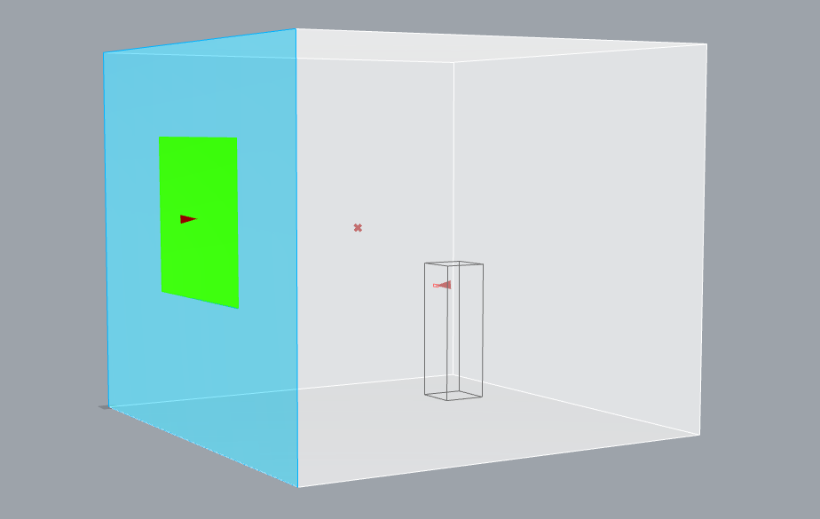
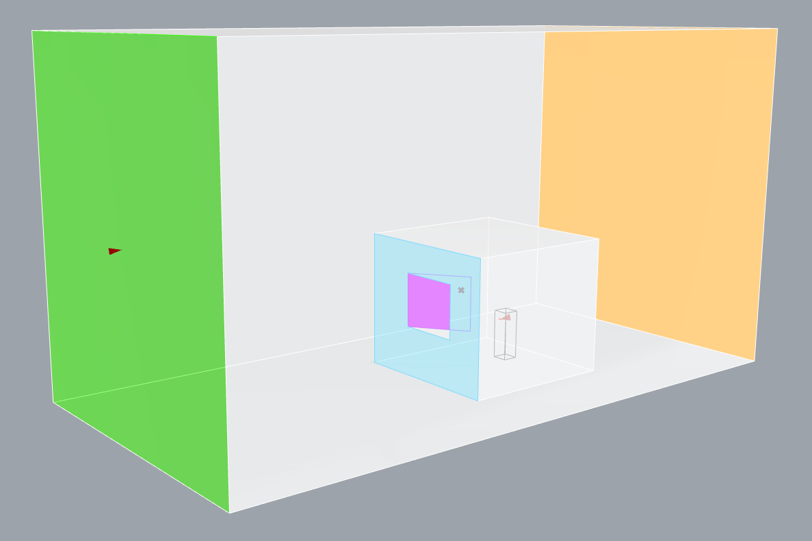

# Examples

Below is a collection of examples with descriptions to help you get started quickly.

## Quick Navigation

- Example 01: [A simple mechanically ventilated (mixing ventilation) room](#example-01): 
  - [Transient](#example-01a): `01a_simple_mech_vent_transient.gh`
  - [Steady-state](#example-01b): `01b_simple_mech_vent_steadystate.gh`
- Example 02: [A simple mechanically ventilated (mixing ventilation) room with a manikin (LOD 0)](#example-02):
  - [Transient](#example-02a): `02a_simple_mech_vent_human_lod0_transient.gh`
  - [Steady-state](#example-02b): `02b_simple_mech_vent_human_lod0_steadystate.gh`
- Example 03: [A simple naturally ventilated room with a manikin (LOD 0)](#example-03):
  - [Transient with dynamic window boundary condition](#example-03a): `03a_simple_nat_vent_human_lod0_transient.gh`
  - [Steady-state with simplified two patches window](#example-03b): `03b_simple_nat_vent_human_lod0_steadystate.gh`
  - [Single-side casement window with a bounding box](#example-03c): `03c_simple_nat_vent_human_lod0_boundingbox.gh`

## Example 01

A simple mechanically ventilated (mixing ventilation) room:

- White: Walls and floor
  - T: 295.15 K
- Green: Air inlet
  - U: 0.5 m/s
  - T: 283.15 K
  - CO2: 400 ppm
- Orange: Air outlet
- Blue: Ceiling (excluding air inlets and outlets)
  - T: 295.15 K
- Dark gray: A solid body with a higher surface temperature
  - T: 305 K
- Internal Fields
  - T: 300 K
  - CO2: 1000 ppm

### Example 01a

Transient simulation (0 - 300 s). Results in ParaView:

<table style="table-layout: fixed; width: 100%;">
  <tr>
    <td align="center" valign="top">
      
       
      
        time = 5 s
      
    </td>
    <td align="center" valign="top">
      
       
      
        time = 30 s
      
    </td>
    <td align="center" valign="top">
      
       
      
        time = 90 s
      
    </td>
    <td align="center" valign="top">
      
       
      
        time = 300 s
      
    </td>
  </tr>
</table>

#### Residuals:

### Example 01b

Steady-state simulation (2000 iterations). Results in ParaView:

#### Residuals:

[Back to top ↥](#quick-navigation)

## Example 02

A simple mechanically ventilated (mixing ventilation) room with a manikin (LOD 0):

- White: Walls and floor
  - T: 295.15 K
- Green: Air inlet
  - U: 0.2 m/s
  - T: 293.15 K
  - CO2: 400 ppm
- Orange: Air outlet
- Blue: Ceiling (excluding air inlets and outlets)
  - T: 295.15 K
- Black: A manikin with Level of Detail of 0
  - T: 307.85 K
  - Body Surface Area: 1.7 m2
- Red: Mouth of the manikin
  - U: 7.2 L/min
  - T: 309.15 K
  - CO2: 46000 ppm (0.0055 L/s CO2)
- Internal Fields
  - T: 300 K
  - CO2: 1000 ppm

### Example 02a

Transient simulation (0 - 300 s). Results in ParaView:

<table style="table-layout: fixed; width: 100%;">
  <tr>
    <td align="center" valign="top">
      
       
      
        time = 5 s
      
    </td>
    <td align="center" valign="top">
      
       
      
        time = 30 s
      
    </td>
    <td align="center" valign="top">
      
       
      
        time = 90 s
      
    </td>
    <td align="center" valign="top">
      
       
      
        time = 300 s
      
    </td>
  </tr>
</table>

#### Residuals:

### Example 02b

Steady-state simulation (2000 iterations). Results in ParaView:

#### Residuals:

[Back to top ↥](#quick-navigation)

## Example 03

A simple naturally ventilated room with a manikin (LOD 0):

- White: Walls & floor & ceiling
  - T: 295.15 K
- Blue: Outer wall (excluding window)
  - T: 295.15 K
- Black: A manikin with Level of Detail of 0
  - T: 307.85 K
  - Body Surface Area: 1.7 m2
- Red: Mouth of the manikin
  - U: 7.2 L/min
  - T: 309.15 K
  - CO2: 46000 ppm (0.0055 L/s CO2)
- Internal Fields
  - T: 300 K
  - CO2: 1000 ppm
  - p: 101325 Pa
  
For natural ventilation (through window), there are a few different ways to simulate it:

> Note: The boundary conditions for the following three cases differ, so they cannot be directly compared.

- Option 1: For transient simulation, you can use Carbonfly Dynamic Window (pressure driven dynamic boundary condition: `pressureInletOutletVelocity`) that has been validated in our previuos work
  - Green: Window
    - U: 0.001 m/s
    - T: 285.15 K
    - CO2: 400 ppm
    - p: 101325 Pa
- Option 2: For simplified steady-state simulation, you may divide the window into two patches (e.g., window_top / window_bottom). Since buoyancy-driven air exchange correlates with temperature differences, when outdoor temperatures are lower, the lower half of the window draws in air while the upper half expels it; when outdoor temperatures are higher, the opposite occurs.
  - Orange: window_top
    - Outlet
  - Green: window_bottom
    - U: 0.01 m/s
    - T: 285.15 K
    - CO2: 400 ppm
- Option 3: If you are focusing not only on the indoor distribution of CO2, but also on the window ventilation process, it is recommended that you use a sufficiently large bounding box for the simulation, as described in the paper by Wang et al. [[10.1016/j.enbuild.2017.01.070](http://dx.doi.org/10.1016/j.enbuild.2017.01.070)]. This approach allows for a more precise analysis of how different window types affect ventilation.
  - Orange: Bounding box outlet
    - Outlet
  - Green: Bounding box inlet
    - U: 0.1 m/s
    - T: 285.15 K
    - CO2: 400 ppm
  - White (room) & Blue (outer wall excluding window) & Purple (single-side casement window):
    - T: 295.15 K
  - White (bounding box):
    - T: 285.15 K

> Note: Option 3 will significantly increase the required simulation time, as the mesh size is much larger. Additionally, nearby buildings and vegetation will affect the external wind field.

<table style="table-layout: fixed; width: 100%;">
  <tr>
    <td align="center" valign="top">
      
       
      
        Option 1: Carbonfly Dynamic Window boundary condition
      
    </td>
    <td align="center" valign="top">
      
       
      
        Option 2: Simplified two patches window
      
    </td>
    <td align="center" valign="top">
      
       
      
        Option 3: Bounding box
      
    </td>
  </tr>
</table>

### Example 03a

Option 1: Carbonfly Dynamic Window boundary condition. Transient simulation (0 - 300 s). Results in ParaView:

### Example 03b

Option 2: Simplified two patches window. Steady-state simulation (5000 iterations). Results in ParaView:

### Example 03c

Option 3: Single-side casement window with a bounding box. Steady-state simulation (5000 iterations). Results in ParaView:

[Back to top ↥](#quick-navigation)