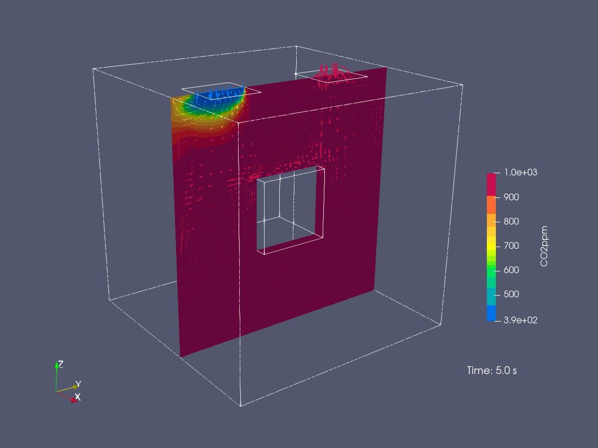

# Examples

Below is a collection of examples with descriptions to help you get started quickly.

## Quick Navigation

- Example 01: [A simple mechanically ventilated (mixing ventilation) room](#example-01): 
    - [Transient](#example-01a): `01a_simple_mech_vent_transient.gh`
    - [Steady-state](#example-01b): `01b_simple_mech_vent_steadystate.gh`

## Example 01

A simple mechanically ventilated (mixing ventilation) room:

- White: Walls and floor
  - T: 295.15 K
- Green: Air inlet
  - U: 0.5 m/s
  - T: 283.15 K
  - CO2: 400 ppm
- Orange: Air outlet
- Blue: Ceiling (excluding air inlets and outlets)
  - T: 295.15 K
- Dark gray: A solid body with a higher surface temperature
  - T: 305 K
- Internal Fields
  - T: 300 K
  - CO2: 1000 ppm

### Example 01a

Transient simulation (0 - 300 s). Results in ParaView:

<table style="table-layout: fixed; width: 100%;">
  <tr>
    <td align="center" valign="top">
      
       
      
        time = 5 s
      
    </td>
    <td align="center" valign="top">
      
       
      
        time = 30 s
      
    </td>
    <td align="center" valign="top">
      
       
      
        time = 90 s
      
    </td>
    <td align="center" valign="top">
      
       
      
        time = 300 s
      
    </td>
  </tr>
</table>

#### Residuals:

### Example 01b

Steady-state simulation (2000 iterations). Results in ParaView:

#### Residuals:

[Back to top ↥](#quick-navigation)